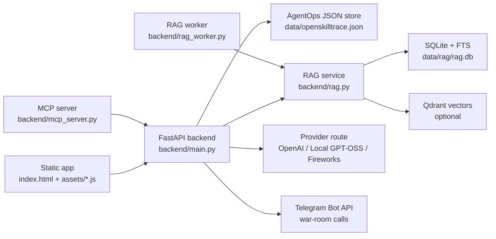

# OpenSkillTrace

[](https://www.python.org/)
[](https://fastapi.tiangolo.com/)
[](https://developer.mozilla.org/en-US/docs/Web/JavaScript)
[](https://modelcontextprotocol.io/)
[](#project-status)

OpenSkillTrace is a low-code AgentOps workflow platform for high-risk operational agents. It lets teams build visual agent workflows while wrapping every run in trace, fallback, replay/eval, policy, human approval, audit, and capability-capture controls.

The flagship prototype is a Monee FraudOps workflow for scam and transaction-risk response: collect a customer claim, gather evidence, ground the case in policy/RAG, classify refund likelihood, block unsafe automation, and create an employee approval ticket.

## Why OpenSkillTrace

Most workflow builders help teams assemble agents. OpenSkillTrace focuses on what happens when those agents operate inside regulated, high-risk business processes.

- Visual workflow builder for input, agent, tool, RAG, MCP, approval, output, and harness nodes.
- Workflow-driven preview runs with server-sent events, node/edge state, and traceable assistant output.
- Fail-closed model routing across OpenAI, local OpenAI-compatible GPT-OSS, and Fireworks GPT-OSS providers.
- Governed RAG with uploads, chunking, PII redaction, Qdrant vector search, SQLite keyword fallback, and citation eval.
- Human approval loops for refunds, escalations, repair promotions, and classifier feedback.
- Sandbox repair artifacts under `data/harness-runs/{run_id}/` before anything is promoted.
- MCP server for Codex or other MCP clients to inspect and operate the AgentOps backend.
- Telegram war-room calls for high-priority approval tickets and operational incidents.

## Product Surface

Open the app at `http://localhost:8000` after starting the backend.

| Route | Purpose |
| --- | --- |
| `/#overview` | Cross-project Ops Command dashboard |
| `/#notifications` | Operational notification inbox with fallback and approval status |
| `/#warroom` | Incident war room with workflow, terminal, and voice-call controls |
| `/#studio` | Drag/drop Workflow Studio and live Preview runner |
| `/#templates` | Workflow template starter gallery |
| `/#tickets` | Employee approval tickets and case decisions |
| `/#catalog` | Catalog of MCP tools, RAG sources, skills, policy packs, and plugins |
| `/#rag` | Governed RAG Builder |
| `/#providers` | Model provider route and key status |
| `/#logs` | API/model usage logs with fallback visibility |
| `/#fallback` | Model, tool, skill, RAG, and workflow fallback center |
| `/#eval` | Replay suites and publish gates |
| `/#governance` | Policy, permissions, audit, and PII controls |

## Architecture



## Quick Start

### Prerequisites

- Python 3.12+
- Node.js, only for JavaScript syntax checks
- Docker and Docker Compose, optional
- Qdrant, optional for vector RAG; SQLite keyword fallback works when Qdrant is unavailable

### Run Locally

```bash
cp .env.example .env.local
python3 -m venv .venv
source .venv/bin/activate
pip install -r requirements.txt
uvicorn backend.main:app --reload
```

Then open:

```text
http://localhost:8000
```

Notes:

- The backend loads `.env` and `.env.local` automatically.
- Keep provider keys in backend env files only; the frontend must never receive plaintext secrets.
- If you copied `.env.example` and run Python outside Docker, set `OST_QDRANT_URL=http://localhost:6333` when using a local Qdrant container.
- If no model provider completes a preview run, OpenSkillTrace emits failure events and creates a blocked repair proposal instead of fabricating assistant output.

### Run With Docker Compose

```bash
cp .env.example .env.local
docker compose up --build
```

Docker Compose starts:

- `openskilltrace` on `http://localhost:8000`
- `mcp` SSE server on `http://localhost:8001/sse`
- `rag-worker` for queued indexing jobs
- `qdrant` on ports `6333` and `6334`

Stop the stack:

```bash
docker compose down
```

## Configuration

Important environment variables:

| Variable | Purpose |
| --- | --- |
| `OPENAI_API_KEY` | Server-side OpenAI key for preview and realtime calls |
| `FIREWORKS_API_KEY` | Fireworks fallback provider key |
| `OST_MODEL_ROUTE` | Ordered provider route, default `openai,local_gpt_oss,fireworks_gpt_oss` |
| `OST_DEFAULT_MODEL` / `OST_OPENAI_MODEL` | Configurable OpenAI model ID |
| `OST_LOCAL_OPENAI_BASE_URL` | Local OpenAI-compatible endpoint, default `http://localhost:11434/v1` |
| `OST_LOCAL_OPENAI_MODEL` | Local model ID, default `gpt-oss:20b` |
| `OST_FIREWORKS_MODEL` | Fireworks fallback model ID |
| `OST_DATABASE_PATH` | Durable AgentOps JSON store path |
| `OST_SECRET_ENCRYPTION_KEY` | Secret used to encrypt stored provider keys |
| `OST_AUDIT_SIGNING_SECRET` | HMAC secret for audit packet signatures |
| `OST_ENV` | Set to `production` to require write authorization |
| `OST_PLATFORM_API_TOKEN` | Bearer token required for writes in production |
| `OST_RAG_EMBED_PROVIDER` | `local` or `openai` embeddings |
| `OST_QDRANT_URL` | Qdrant endpoint |
| `OST_PUBLIC_BASE_URL` | Public app URL used in Telegram war-room links |

Model IDs in this repo are configuration defaults, not a guarantee that a provider account has access to a specific model.

## Telegram War-Room Calls

Telegram notifications are sent from the backend when an employee approval ticket is created. They can also be triggered manually from Notification Inbox, My Tickets, or War Room.

Required settings:

```bash
OST_TELEGRAM_BOT_TOKEN=
OST_TELEGRAM_CHAT_ID=
OST_PUBLIC_BASE_URL=http://localhost:8000
```

Optional setting for Telegram forum topics:

```bash
OST_TELEGRAM_MESSAGE_THREAD_ID=
```

The bot must be started by the target user or added to the target group/channel before Telegram accepts messages. Use this endpoint to confirm configuration:

```bash
curl http://localhost:8000/api/telegram/status
```

## RAG Builder

OpenSkillTrace treats RAG as governed operational knowledge, not a generic document store.

Supported source types:

- `.txt`
- `.md`
- `.csv`
- `.pdf`

RAG capabilities:

- Upload sources and attach them to workflow RAG nodes.
- Parse text, Markdown, CSV, regular PDFs, and OCR fallback for scanned PDFs.
- Redact common PII patterns before chunks are indexed.
- Store source/job/chunk metadata in SQLite.
- Use Qdrant vector search when available.
- Fall back to SQLite FTS keyword search when vector search is unavailable.
- Evaluate citation coverage with built-in scenarios.

Run one queued RAG job immediately:

```bash
curl -X POST http://localhost:8000/api/rag/jobs/{job_id}/process
```

Run the background worker:

```bash
python3 -m backend.rag_worker
```

## MCP Server

This repo includes a stdio and SSE MCP server in `backend.mcp_server`.

Run stdio:

```bash
python3 -m backend.mcp_server
```

Run SSE:

```bash
python3 -m backend.mcp_server --transport sse --host 0.0.0.0 --port 8001
```

Run SSE with Docker Compose:

```bash
docker compose up --build -d mcp
```

Codex can discover the stdio server from `.mcp.json` as `openskilltrace`, or the SSE server as `openskilltrace-sse` at `http://localhost:8001/sse`.

Available MCP tools cover:

- Health and provider-route metadata
- AgentOps collection CRUD
- Settings persistence
- Scam-response investigation packets
- Customer intake schema helpers
- Workflow preview collection and run inspection
- Harness repair approval/rejection
- Case approval decisions
- RAG upload, config, indexing, search, and eval

## API Overview

Core endpoints:

| Endpoint | Description |
| --- | --- |
| `GET /api/health` | Service status and active model metadata |
| `GET /api/logs` | API/model usage logs and fallback stats |
| `POST /api/workflow-runs/stream` | SSE workflow preview run |
| `GET /api/workflow-runs/{run_id}` | Run details, events, artifact, and promoted capabilities |
| `POST /api/workflow-runs/{run_id}/approval` | Approve or reject a harness repair proposal |
| `POST /api/workflow-runs/{run_id}/case-approval` | Approve refund, reject, or escalate a case ticket |
| `POST /api/realtime/session` | Create an OpenAI realtime voice session for War Room |
| `GET /api/telegram/status` | Telegram configuration status |
| `POST /api/telegram/warroom-call` | Send a Telegram war-room message |
| `POST /api/investigations/scam-response` | Create an evidence-only scam-response audit packet |

Durable collection routes expose `GET`, `POST`, `PATCH`, and `DELETE`:

```text
/api/workflows
/api/mcp/servers
/api/providers
/api/provider-keys
/api/fallback-policies
/api/replay/scenarios
/api/approvals
/api/audit-events
/api/workflow-runs
/api/run-events
/api/harness-artifacts
/api/capabilities
/api/tickets
/api/classifier-feedback
/api/harness-learning
```

RAG endpoints:

```text
GET    /api/rag/config
PATCH  /api/rag/config
GET    /api/rag/sources
POST   /api/rag/sources/upload
DELETE /api/rag/sources/{source_id}
POST   /api/rag/sources/{source_id}/reindex
GET    /api/rag/jobs/{job_id}
POST   /api/rag/jobs/{job_id}/process
POST   /api/rag/search
```

## Security Model

OpenSkillTrace is a prototype, but the repo already implements several production-minded safety rules:

- Provider keys are encrypted before persistence and never returned as plaintext.
- API responses expose only masked keys, fingerprints, source, and status metadata.
- Writes require a bearer token when `OST_ENV=production`.
- Workflow preview fails closed when no configured provider can answer.
- High-risk actions produce approval packets instead of executing refunds, freezes, reversals, AML reports, or customer-contact actions directly.
- Harness repair files are written only under `data/harness-runs/{run_id}/`.
- Repair approval is blocked when replay/eval gates fail.
- RAG chunks are PII-redacted before indexing and search excerpts are returned.
- Audit events are persisted for investigations, Telegram sends/skips/failures, approvals, and repair decisions.

Before using this in production, add real authentication, external secret management, a durable database, connector-level permissions, and deployment hardening.

## Testing

Run the Python test suite:

```bash
python3 -m pytest tests -q
```

Syntax-check the frontend:

```bash
node --check assets/icons.js
node --check assets/data.js
node --check assets/views-build.js
node --check assets/views-reliability.js
node --check assets/views-warroom.js
node --check assets/views-notifications.js
node --check assets/studio.js
node --check assets/app.js
```

The tests cover health checks, collection CRUD, provider-key redaction, workflow preview streaming, fail-closed provider behavior, repair approval gates, case approvals, Telegram audit events, RAG indexing/search, and MCP tool access.

## Repository Layout

```text
.
|-- assets/                     # Vanilla JS views, data, icons, and CSS
|-- backend/
|   |-- main.py                 # FastAPI app, workflow runs, approvals, Telegram
|   |-- rag.py                  # Governed RAG store, indexing, search, eval
|   |-- rag_worker.py           # Background RAG indexing worker
|   `-- mcp_server.py           # MCP tools over stdio or SSE
|-- docs/
|   `-- OpenSkillTrace_UXUI_PRD.md
|-- graphify-out/               # Generated repository knowledge graph artifacts
|-- scripts/                    # Graphify pre-push automation
|-- tests/                      # Backend, RAG, and MCP tests
|-- docker-compose.yml
|-- Dockerfile
|-- index.html
|-- requirements.txt
`-- README.md
```

## Graphify Automation

This repo can refresh its Graphify knowledge graph before every `git push`.

Install the hook:

```bash
scripts/install-graphify-pre-push-hook.sh
```

The hook runs `graphify update .` for code changes. If docs, HTML, images, or media changed, it sources `.env.local` when present and runs a full semantic `graphify extract` when an LLM API key is available. If no key is available, it marks `graphify-out/.needs_update` so a semantic refresh can be run intentionally.

Override behavior per push:

```bash
GRAPHIFY_PRE_PUSH_FULL=1 git push  # force full semantic extraction
GRAPHIFY_PRE_PUSH=0 git push       # skip the hook once
GRAPHIFY_PRE_PUSH_FULL=0 git push  # force fast code-only graph refresh
```

## Project Status

OpenSkillTrace is an MVP/prototype workspace. The current repo is strongest as a product prototype, local demo, API harness, and AgentOps/RAG/MCP experiment.

Implemented:

- Static multi-screen frontend
- FastAPI backend with durable local persistence
- Workflow preview SSE stream
- Fail-closed provider fallback route
- Approval tickets and classifier feedback
- Harness repair sandbox artifacts
- Governed RAG with vector and keyword fallback
- MCP server
- Telegram war-room notifications
- Docker Compose stack
- Test coverage for the main backend loops

Next likely hardening steps:

- Add repository license and contribution policy.
- Replace local JSON persistence with a production database.
- Add real user auth, RBAC, and workspace isolation.
- Move secrets to a managed secret store.
- Connect real fraud/evidence/RAG systems.
- Add frontend end-to-end tests and screenshots.
- Package deployment configuration for a production environment.

## Contributing

Before opening a PR or sharing a branch, run:

```bash
python3 -m pytest tests -q
node --check assets/icons.js assets/data.js assets/views-build.js assets/views-reliability.js assets/views-warroom.js assets/views-notifications.js assets/studio.js assets/app.js
```

Keep generated runtime data out of commits unless the change intentionally updates `graphify-out/` or a documented artifact.

## License

No license file is currently included. Add a license before publishing the repository broadly or accepting external contributions.

